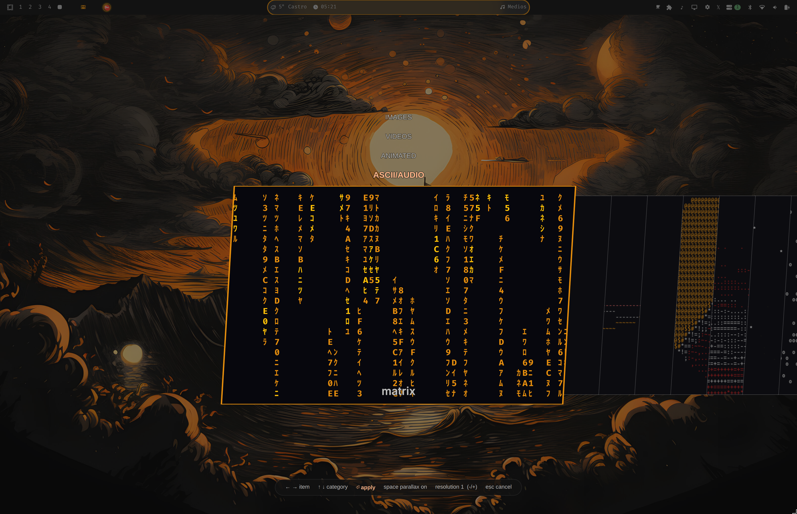
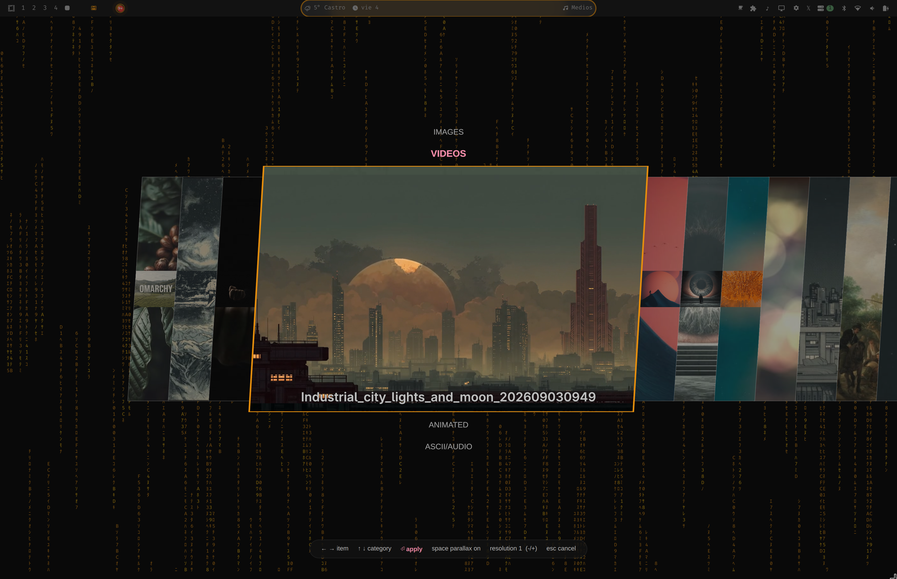

# omarchy-animated-background

> **BETA — preview of a future Omarchy feature.** This is the testing plugin
> edition of the parallax/multi-source background system proposed to Omarchy
> as a shell PR. It exists so users can try the feature on a **stock
> Omarchy** install (no shell patches) while the upstream PR is reviewed;
> once it lands in Omarchy, this plugin becomes unnecessary.

Mouse-parallax, multi-source backgrounds for [Omarchy](https://omarchy.org) —
as a **plugin**. Installing the plugin gives you the same
system on a **stock Omarchy** install, no shell patches required.

The plugin renders its own background layer (image, video, animated, programmable
pixel-art scrolling, and layered parallax scenes) above the regular wallpaper,
and ships a background switcher with live previews.

## Features

- **Layered parallax scenes** — a scene is a folder: `layers/0-*.svg … N-*.svg`
  stacked back → front, each drifting with mouse depth (`+` / `-` sets the
  strength 1–8 in the switcher, `space` toggles the drift). Optional
  `parallax.json` overrides per-layer factors; a `poster.jpg` next to the
  layers is the static fallback/preview.
- **Animated sources** — `gif`/`webp`/`apng` are converted once to a cached
  looping `mp4`; static/responsive `svg` artwork gets the parallax drift.
- **Videos** and plain **images**, with crossfade transitions.
- **PROGRAMMABLE demo/game engine** — original procedural scenes inspired by SNES and
  Amiga-era demos: low-resolution tile layers, independent scroll speeds,
  limited palettes, stars, perspective grids and scanlines. The PNGs are only
  selector posters; the active scene is rendered by the engine at runtime.
- **ASCII/AUDIO category** — live effect previews in the switcher (install the
  companion [omarchy-audio-background](https://github.com/avillagran/omarchy-audio-background)
  plugin to also run them as real desktop backgrounds).
- **Live background switcher** — skewed-carousel picker, instant static
  posters under live media previews, live dir watching (drop a file in and it
  appears), selection restore on cancel.
- Bar text color keeps working: the plugin keeps the canonical
  `~/.local/state/omarchy/current/background` symlink pointing at the real
  media, which Omarchy's `omarchy-bar-text-color` already samples.

| ~ | What you get |
|---|---|
|  |  |

## Install

### One-liner installer

Installs and enables all three plugins, installs FS-UAE, and binds
`Ctrl+Super+Space` to the selector:

```sh
curl -fsSL https://raw.githubusercontent.com/avillagran/omarchy-animated-background/main/install.sh | bash
```

The installer is repeatable. To review its contents before running it:

```sh
curl -fsSL https://raw.githubusercontent.com/avillagran/omarchy-animated-background/main/install.sh
```

```sh
# 1. Plugin (classic install: clone + enable)
omarchy plugin add https://github.com/avillagran/omarchy-animated-background --enable --yes

# 2. Companion plugin — required for the ASCII/AUDIO backgrounds and their
#    live previews (it renders the effects as real desktop backgrounds)
omarchy plugin add https://github.com/avillagran/omarchy-audio-background --enable --yes

# 3. Sample content — 11 videos + 2 ready-made parallax scenes
#    (skip if you already have your own ~/Wallpapers content)
curl -sL -o /tmp/omarchy-wallpapers.zip \
  https://github.com/avillagran/omarchy-animated-background/releases/download/samplepack-v1/omarchy-wallpapers-samplepack.zip \
  && unzip -qo /tmp/omarchy-wallpapers.zip -d /tmp \
  && cp -r /tmp/omarchy-wallpapers-samplepack/Wallpapers ~/ \
  && rm -rf /tmp/omarchy-wallpapers.zip /tmp/omarchy-wallpapers-samplepack

# 4. Open the switcher once (or bind it — see below)
omarchy-shell io.github.avillagran.omarchy-animated-backgrounds toggle
```

Add a keybind to open/close the switcher (e.g. in your Hyprland user
config / sensei binds):

```
bind = SUPER, B, exec, omarchy-shell -q io.github.avillagran.omarchy-animated-backgrounds toggle
```

> **Bind takeover:** on first load the plugin takes over Omarchy's stock
> `SUPER + CTRL + SPACE` (which opens the built-in background chooser) and
> points it at this plugin's switcher instead. It does so by installing
> `~/.config/hypr/hypr/parallax-backgrounds.lua` and adding one
> `require("hypr.parallax-backgrounds")` line to `~/.config/hypr/hyprland.lua`
> (idempotent, reapplied on every plugin load).
> **Opt out:** delete that require line and run `hyprctl reload` — the stock
> chooser bind returns.

Or from a terminal:

```sh
omarchy-shell -q io.github.avillagran.omarchy-animated-backgrounds toggle
```

### Companion plugin

Step 2 of the install installs
[omarchy-audio-background](https://github.com/avillagran/omarchy-audio-background),
which renders the ASCII/AUDIO effects as real desktop backgrounds and powers
their live previews in the switcher. Without it, applying an ASCII effect
leaves a transparent background (your previous wallpaper shows through)
instead of the effect.

### Amiga demos

The **AMIGA DEMOSCENE** category runs user-provided `.adf` and `.dms` demos
through the separate `omarchy-amiga` service. FS-UAE is the only emulator
backend; the animated-backgrounds plugin does not bundle an emulator, ROMs, or
demo media.

Install both plugins and FS-UAE on an Arch/Omarchy system:

```sh
omarchy plugin add https://github.com/avillagran/omarchy-amiga --enable --yes
~/.config/omarchy/plugins/io.github.avillagran.omarchy-amiga/bin/omarchy-amiga-install --install-deps
```

Put user-owned demo disks under `~/Wallpapers/Amiga/`. A demo may be a disk in
the directory itself or in a subdirectory with an optional `thumb.*`,
`poster.*`, or `preview.*` image. Generate the local FS-UAE sidecars before
opening the selector:

```sh
mkdir -p ~/Wallpapers/Amiga
unzip -o /path/to/omarchy-amiga-demos-v0.1.zip -d ~/Wallpapers/Amiga
~/.config/omarchy/plugins/io.github.avillagran.omarchy-amiga/bin/omarchy-amiga-generate-fsuae \
  ~/Wallpapers/Amiga --force
```

The generated `omarchy.fs-uae` files remain beside the local disks and are not
committed to either repository. They use FS-UAE's internal AROS ROM by
default. If a production needs a proprietary Kickstart for full compatibility,
provide that legally in `~/Documents/FS-UAE/Kickstarts/`; never download or
commit ROMs.

Press `Enter` on a selected demo to apply it as the background. `L` changes the
Amiga playback mode: with loop **off** (default), the current demo repeats
continuously; with loop **on**, FS-UAE advances to the next demo when the disk
finishes. `M` toggles FS-UAE audio. `S` toggles shuffle for Videos, Amiga, and
ASCII/AUDIO; its state is stored in
`~/.local/state/omarchy/background/shuffle`.

## Where your content goes

> **Just want to try it?** Grab the
> [sample wallpapers pack](https://github.com/avillagran/omarchy-animated-background/releases/tag/samplepack-v1)
> (11 videos + 2 parallax scenes) and unzip it into your home directory —
> the switcher picks the files up live.

```
~/Wallpapers/Images/    still images (jpg/png/webp/bmp; theme wallpapers also listed)
~/Wallpapers/Videos/    videos (mp4/mkv/mov/webm/avi)
~/Wallpapers/Animated/  gif/webp/apng/svg files AND parallax scene directories
~/Wallpapers/Retro/     programmable Lua scenes (+ optional same-name PNG poster)
~/Wallpapers/Amiga/     demo folders containing .dms/.adf + thumb/poster/preview image
```

Programmable scenes can also be placed in `~/.config/omarchy/retro/`; each `.lua`
file is loaded by the engine and its same-name `.png`/`.jpg` is optional for
the picker preview. The bundled filenames select the examples (`tron`,
`neon-district`, `sunset-run`, and `spaceballs`).

If the PlebsPlayer repository is present at `~/Desarrollo/PlebsPlayerOSS`, its
visualizer presets are listed automatically as RETRO scenes too. The engine
accepts the PlebsPlayer global API (`setup`, `render`, `width`, `height`,
`time`, `delta`, `bass`, `mid`, `treble`, `spectrum`, `waveform`, `beat`,
`rgb`, `rgba`, `hsv`, `hsva`, `wave`, and the primitive drawing functions), so
the same Lua preset can be used by both projects. Audio values are accepted
by the frame protocol; the background bridge can provide them without
changing the preset.

A scene returns one render function. It receives the frame number and a small
API (`clear`, `rect`, `line`, `circle`, `poly`) and returns drawing commands:

```lua
return function(frame, api)
  return {
    api.clear("#050817"),
    api.rect((frame % 320), 80, 8, 8, "#00ffff"),
    api.line(0, 120, 320, 120, "#ff00aa", 1),
  }
end
```

For the `nfd/sota`/Spaceballs shape format, convert the original JSON data
(`indices` + `data`) instead of recreating the animation by hand:

```sh
bin/sota-json-to-lua.py script0b989c.json ~/Wallpapers/Retro/spaceballs-3d.lua
```

The converter ports the SOTA `dX` polygon commands and `e6/e7/e8/f2` tween
commands to a self-contained Lua scene. It scales the original 256x205
coordinates to the RETRO renderer and preserves the frame sequence. DMS files
are Amiga disk images containing binaries/data, not source code; unpack them
with an external DMS/ADF tool first and feed any recovered SOTA JSON to this
converter.

A **parallax scene** is a directory in `~/Wallpapers/Animated/`:

```
my-scene/
  layers/
    0-sky.svg        # back layer (any raster works inside the wrapper)
    1-hills.svg
    2-trees.svg      # front layer
  parallax.json      # optional: {"layers": {"0-sky": 0.0, "1-hills": 0.4, "2-trees": 1.0}}
  poster.jpg         # optional: static preview / fallback
```

Layer order is the numeric prefix (0 = back). Factor `0.0` = static,
`1.0` = full mouse drift. Default is linear depth (`i/(N-1)`).

## Switcher keys

| Key | Action |
| --- | --- |
| `←` `→` / `Tab` `Shift+Tab` | move between items |
| `↑` `↓` | switch category |
| `Enter` | apply |
| `Space` | toggle parallax movement |
| `+` / `-` | parallax resolution 1–8 (default 2) |
| `S` | shuffle Videos, Amiga, and ASCII/AUDIO |
| `L` | Amiga: repeat current demo / advance to next demo |
| `M` | Amiga: toggle emulator audio |
| `Esc` | cancel (restores the previous background) |

Double-clicking the desktop still opens Omarchy's regular wallpaper/theme
switchers as usual.

## Notes & limitations

- The stock Omarchy wallpaper keeps rendering underneath; this plugin draws
  its own layer on top of it. Selecting a background here does **not** change
  Omarchy's own wallpaper setting.
- Live ASCII **backgrounds** (not just previews) need the companion
  `omarchy-audio-background` plugin; without it the ASCII category still
  previews natively-rendered effects and applies show a transparent
  background.
- Regenerating ASCII preview videos (optional) needs `ttfx` on PATH
  (`TTFX_BIN` overrides). All 20 effect posters ship with the plugin.

## Local development

```sh
ln -sfn "$PWD" ~/.config/omarchy/plugins/io.github.avillagran.omarchy-animated-backgrounds
omarchy-shell shell rescanPlugins
omarchy-restart-shell
```

## License

MIT
